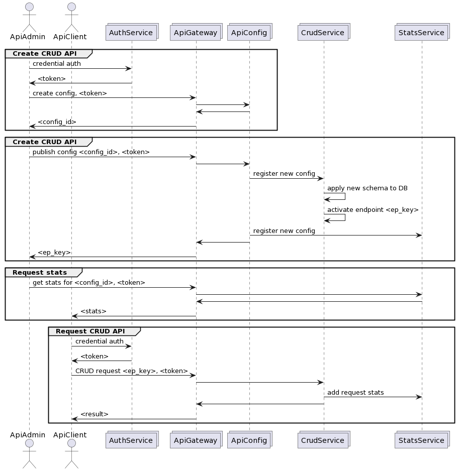

# Architecture review
This section currenlty is in development.

## Roles
- **Api Config Admin.** Manages API configs, permissions and statistics. Is able to create, update, delete and publish CRUD API schemas.
- **Api Client.** Consumes published CRUD APIs. Permissions to access APis and API endpoint url/key may be granted by admins.

## Services interaction

*Schema 1. Possible implementation of the service.*

